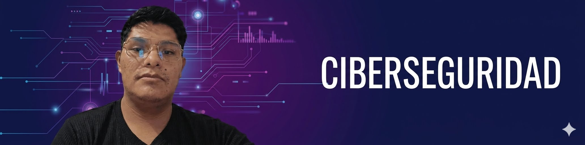

<!-- BANNER DE PORTADA (Ocupa el 100% del ancho) -->

  

<!-- ENCABEZADO PRINCIPAL -->
<h1 align="center">William Vásquez</h1>

  <b>Estudiante de Ciberseguridad & Auditoría Informática | Tecsup</b>

<!-- INSIGNIAS DE ENFOQUE (Usando tus paletas de colores) -->

  
  
  

---

## Perfil Profesional

Estudiante de especialización técnica en **Tecsup**, enfocado en la protección de infraestructuras tecnológicas, el análisis de redes y la auditoría de sistemas. Me especializo en la seguridad defensiva (Blue Team) para identificar vulnerabilidades y asegurar la integridad de la información.

Cuento con una sólida experiencia laboral previa, lo que me aporta una fuerte ética de trabajo, disciplina, resiliencia y un alto nivel de responsabilidad en la gestión de proyectos y la resolución de problemas bajo presión.

---

## Stack Tecnológico y Herramientas

| Categoría | Herramientas y Tecnologías |
| :--- | :--- |
| **Sistemas Operativos** | `Linux (Ubuntu, Kali)`, `Windows Server` |
| **Redes y Análisis** | `TCP/IP`, `Wireshark`, `Nmap`, `Routing & Switching` |
| **Seguridad / Hacking** | `Fundamentos SOC`, `Análisis de Vulnerabilidades`, `TryHackMe` |
| **Automatización / Control** | `Python (Básico/Intermedio)`, `Git & GitHub` |

---

## Proyectos en Portafolio

*(Aquí es donde irán tus laboratorios y análisis. Estos son ejemplos de lo que puedes documentar)*

*   🔍 **[Próximamente] Análisis de Tráfico de Red con Wireshark** – Captura y auditoría de paquetes para identificar credenciales en texto plano y patrones de ataque.
*   🐍 **[Próximamente] Scripts de Automatización en Python** – Herramientas básicas para el escaneo de puertos y gestión de logs.

---

## Estadísticas de GitHub

  

---

## Contacto y Enlaces

   &nbsp;&bull;&nbsp;
  

